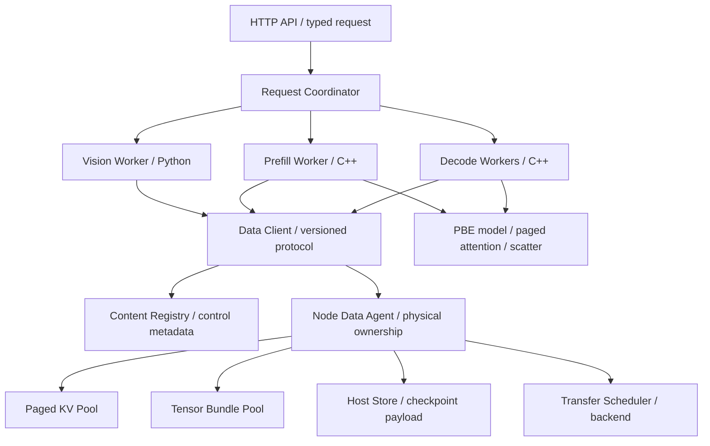

# PBE：支持多角色与多模态数据共享的分页推理引擎

## 1. 架构决策

PBE 的目标从单引擎 KV 运行时升级为：计算角色通过数据句柄协作，框架管理数据身份、物理容量、共享、迁移与回收，C++/CUDA 核心继续承担语言模型的分页推理。首个完整场景是图像理解：Vision Encoder → Prefill → 多个 Decode 消费者。共享前缀构建是 Prefill 的一种任务，不另复制一个模型实现。

本架构已于 2026-09-12 按 V4 执行计划完成首版实现与验收；逐阶段证据见 `docs/data_flow_evidence/v4/`。源码复核发现已有 PD 引擎、远程 ZMQ/NCCL 路径、本地页目录和迁移原型，因此实现采用渐进改造。旧 V3 的安全性工作继续保留，跨进程共享从可选 X1 提升为主线；通用布局变换、成本模型等按新依赖重新排序。[1][2]

首版部署限定同机双 GPU、受信任进程、TP=1、单一视觉语言模型、静态图像与文本。采用 C++ 数据服务、C++ 语言模型 worker、Python/PyTorch Vision worker；Python 只执行视觉塔与预处理，不代替 PBE 执行语言模型。跨机 RDMA、视频/音频、DiT、推测解码、权重零拷贝共享和任意 DAG DSL 属后续扩展。

## 2. 源码事实与改造边界

| 现有入口 | 本次看到的事实 | 架构影响 |
| --- | --- | --- |
| `serving/pd_engine.h`、`pd_worker.cpp` | Prefill/Decode 已分开，Decode 接收 reservation | 复用执行角色，不重写一套 PD |
| `serving/serving_zmq_rpc.h` | RPC 包含 Prefill、KV transfer/release；远程 payload 用字符串承载 K/V/scales | 保留旧协议 oracle，新增版本化控制协议与二进制数据通道 |
| `serving/serving_benchmark_app.cpp` | 非 NCCL 导出复制到 Host 后释放源请求；NCCL 保留 pending handoff | 一次请求交接不能直接充当跨请求内容存储 |
| `base/block_allocator.h` | allocator 同时拥有物理 Tensor、空闲队列和引用计数 | 必须拆开物理所有者与 worker 的借用视图，不能在两个进程各维护 free queue |
| `base/kv_cache_manager.cpp::publish_radix_cache` | key 编码完整 token 前缀，但 namespace 依靠模型本地目录隐式隔离 | 全局目录必须显式加入模型与多模态语义身份 |
| `cache/page_directory.h` | 单 owner 线程、进程内 map、GPU/Host residency、lease | 作为本地实现基础，不能直接把 map 或指针通过 RPC 暴露 |
| `serving/mixed_batch.h`、`model/qwen2_batch.cpp` | token_ids、单轴 positions、embedding lookup；无完整视觉输入协议 | 新增多模态序列计划、局部 embedding 替换和位置轴输入 |
| `model/paged_kv_runtime.h` | attention/scatter 接口使用 allocator 与页表 | 增加只描述池布局/地址的 view，内核不承担分配或跨进程发现 |
| `serving/serving_online_engine.h` | 在线请求为 prompt 字符串；输出状态由 handle 保存 | 新增 typed parts、媒体对象与输出 revision；保留纯文本适配 |
| `serving/request_checkpoint.cpp` | 当前已见 byte budget、stale commit rejection、取消删除记录 | 旧 V3“这些修复尚未开始”的文字已滞后，必须按当前源码重新验收 |

这些为静态源码事实；本次未运行 PBE 模型回归，也不为已有 NCCL 路径追加“实测可用”结论。[1]

omni-flow 值得借鉴的具体结构是：encoder 公共 role 承担 batching/cache/lifecycle，模型 hook 承担 prepare/collate/forward/split；临时池用 handle+offset+size 和引用维护跨进程 buffer；tensor bundle 把主输出与辅助张量绑定为缓存单元；Qwen3-VL graph 显式 join embedding、grid、DeepStack 与 mRoPE，再进行生成。[3][4][5]

不能把“EPD 分离”或“跨实例视觉 embedding 缓存”宣称为区别于所有 SGLang 的独有能力。当前 SGLang 官方文档已描述 EPD 和 Mooncake 全局多模态 embedding 缓存。本项目的评估重点是统一生命周期合同及其可复现实现，而不是功能名称的首创。[6]

## 3. 总体结构与依赖方向



第一版 Registry 和 Node Data Agent 可以运行在同一个 `pbe-data-service` 进程中，但接口分开：Registry 管内容身份与可服务目录；Agent 管实际分配、lease、fence 和回收。它们的合并部署不允许出现两个资源账本权威。多节点只是未来增加多个 Agent，不要求首版建设分布式共识服务。

| 模块 | 拥有 | 不拥有 |
| --- | --- | --- |
| Request Coordinator | request/branch 状态、stage 依赖、输出 outbox、取消代际 | 物理 block 空闲队列 |
| Role Runtime | 模型权重、workspace、batching、CUDA stream、计算任务 | 全局缓存淘汰决定 |
| Model Adapter | 输入布局、位置语义、权重映射、模型 forward | RPC/provider 选择 |
| Content Registry | 内容到 representation/provider 的索引与版本 | 远程进程的裸指针 |
| Node Data Agent | 池、物理 generation、compute/I/O 引用、可服务发布与撤销 | 文本采样策略 |
| Transfer Runtime | 计划、准入、copy/fence/commit、异常隔离 | 模型语义的猜测转换 |

角色是能力边界，不要求一角色独占一块 GPU。首版 Encoder 与 Prefill 可位于 GPU0 的独立进程，Decode A/B 可位于 GPU1 的独立进程；所有权重和 workspace 都计入设备总预算。用纯文本负载先验证 P→D，随后加入 Encoder。对照实验必须计入重复驻留的语言模型权重。

## 4. 三类身份与三类存储

公共描述分为 `ContentId`、`RepresentationId`、`AllocationHandle`。ContentId 是计算语义，RepresentationId 是 dtype/layout/coverage，AllocationHandle 是 node/pool/slot/generation 的一次物理实例。三者不能混用。[2]

| 数据种类 | 内容身份 | 生命周期与存储 |
| --- | --- | --- |
| `TensorBundle` | 原始媒体内容摘要、encoder 权重 revision、processor 配置、输出 ABI | 变长不可变 bundle；slab/size-class；活跃引用与 LRU 保留引用分开 |
| `KVPageSet` | 语言模型权重/配置、完整有序前缀、媒体特征身份与插入位置、position 语义 | 固定页；完整不可变前缀共享；私有尾页写入/COW |
| `RequestState` | request generation、branch、revision | 可变协调状态；READY checkpoint 为不可变快照，受 record/bytes 双限 |

媒体 key 从已物化字节或可靠的不可变对象版本生成，不能仅用 URL/路径字符串。相同图片、不同 resize/crop 或 encoder revision 不应命中同一特征；同一图片、不同文本问题可以共享视觉特征，但 KV 只共享实际相同的完整前缀。

`TensorBundleManifest` 包含 named tensors、dtype、shape、contiguous strides、offset、nbytes、alignment、schema version、producer completion。第一版限制连续 tensor；不支持的 stride 明确拒绝。所有组件完整并校验后才能发布 bundle READY，不能主 embedding 已就绪但 grid 仍来自另一次运行。

权重首版由各 worker 拥有，不挤入临时池。NodeMemoryBudget 统计 weights + workspaces + KV + bundles + staging + quarantine；权重初始化完成和 workspace 上界确定后才固定 KV/bundle 容量。热加角色需重新准入，不能依靠启动时一次 `cudaMemGetInfo` 永久成立。

## 5. 所有权与共享协议

公共接口建议为版本化消息，不是跨进程 C++ 对象 ABI：

```text
reserve_write(spec, owner_generation, budget) -> WriteTicket | RetryCapacity
seal(ticket, producer_fence, valid_coverage)   -> DataRef
lookup(content, representation)              -> CandidateSet | Miss
acquire(ref, consumer, requirements)          -> ReadLease | Retry | Stale
ensure_local(lease, destination)              -> TransferTicket
release(lease, consumer_completion)           -> Ack
withdraw(replica, publication_epoch)         -> Ack | Pending
```

消息含 protocol_version、request/operation id、owner incarnation、deadline、schema hash、大小上限。重复消息按 operation id 幂等；迟到回包不能让旧进程实例操作新分配。RPC 不发送可在另一进程直接使用的裸指针，导入后本地解析地址；固定注册 endpoint 的可信同机模型先成立。

物理分配权威只有 Agent。Worker 持 `KVPoolView` 与批量 `SlotLease`，通过本地 mailbox 或 RPC 异步请求；现有 KVCacheManager 改成请求页表/前缀视图适配器。模型不得再自行 free 共享块。先保留 `LocalDataRuntime` 适配原 allocator，再启用 service 模式，两种部署共用合同测试。

CUDA IPC 仅提供地址可访问性。Agent 拥有可导出的底层 allocation，worker 导入池，在获得 write lease 后写指定 slot；Agent 验证 producer 的可观察 completion 后发布。消费者释放时同样需要消费 fence。可使用经验证的跨进程 event 或在 worker 确认本次 stream 完成后发送 ACK，不能把 RPC 接收成功当 GPU 完成。IPC capability 在阶段验证，不支持时使用 Host copy oracle 并报告差异。

复制路径遵循 `reserve target → prepare/pin provider → validate all descriptors → copy → fence → revalidate → commit`。源、目标与 staging 在不确定完成时保持或隔离；一个等待者超时只解除它的等待。Registry 中存在记录不保证物理源仍可服务，attach 必须核对 provider incarnation 与 allocation generation。

副本撤销先拒绝新 acquire，再等待/处理已有 lease 与复制，完成目录撤销确认后才考虑回收。首版单节点可由同一 Agent 串行化这些步骤；多节点的 ACK 协议不得被本地锁隐含替代。TTL 仅用于发现失联，不是允许复用内存的 fence。

正常生产请求结束后，已 seal 的缓存由 Agent 的保留策略管理，其他消费者可以继续使用。Worker 崩溃时未 seal 的写入标失败；正在被异常进程访问的资源进入隔离，直到可靠确认 CUDA 工作停止。若无法证明，允许 fail-stop/restart pool，不承诺无损透明恢复。Data service 崩溃使本代所有句柄失效；首版不提供持久化 HA。

## 6. KV 发布、分支与恢复语义

普通 prefix index 只发布完整页。一个分支点如果包含未满尾页，使用专用不可变 `BranchSnapshot` 保存有效长度及尾页；消费者首次追加时复制到私有页。不能为追求共享而让普通 radix 匹配不完整页，也不能忽略未满部分导致少算上下文。

一个内容由多个 producer 冷计算时可以各持私有目标，seal 返回 canonical winner；loser 只有在自身全部 compute/I/O 引用与 fence 结束后才回收。传输 singleflight 与计算去重是不同开关。Prefix Builder 是显式预计算任务，可对同 key 的构建任务合流；在线独立请求是否等待生产者需有有界策略。

`BranchSnapshot` 除 KV 外包含 committed token 数、pending next token 或可重新取得 logits 的明确定义、position state、输入特征引用和采样初始化规则。不能把 PD 已采样的 first_token 盲目复制给所有独立分支；支持共同首 token 或独立采样需在协议中明确区分。每个 branch 有独立 RNG/输出 outbox。

checkpoint 扩展保存多模态 sequence plan、位置轴/delta、特征依赖及恢复配方。数据标记 `Recomputable(recipe, dependencies)` 或 `PreserveUntilReleased`。重新运行 encoder 可能有数值差异；exact continuation 必须保留所需精确特征或等价快照，不能把“模型还能运行”当作可无损重算的证据。最后一份必要数据无法安全保留时拒绝新任务/返回明确错误，不静默丢弃。

首版不支持 LLM/DiT 向同一页不同 slice 并发写；预留组件与恢复依赖描述，未来通过互斥写集合和整页提交扩展。异模型 KV 默认不兼容，即使 tensor shape 相同也不能共享。

## 7. 多模态计算接口与模型选择

建议首个目标为 `Qwen/Qwen2.5-VL-3B-Instruct`，属于设计选择而非已验证兼容。官方配置包含 mRoPE，语言骨干可复用哪些 PBE Qwen2 运算必须通过数值探针确认。SGLang 本地实现使用 Qwen2Model 作为语言部分，这支持“值得验证复用”的判断，但不能证明 PBE 的 Qwen2Model 已兼容。[7][8]

首版 Python Vision worker 只加载同一 checkpoint 的 visual 部分及 merger；模型适配层处理 processor/chat template。C++ 加载该 checkpoint 的语言权重，禁止用已有 Qwen2-0.5B 权重搭配新视觉塔冒充真实 VLM。

`MultimodalSequencePlan` 描述展开后的 token 序列、媒体 spans、feature refs、每段长度、位置轴和 generation position state。`ModelInputAssembler` 验证 spans 后，在对应 prefill 行将 token embedding 替换为视觉特征。位置值与 KV 逻辑写入位置分开：mRoPE 三轴不能取代 block table 中的线性 token offset。[7]

chunked prefill 必须支持 chunk 边界切过视觉 span，部分 prefix 命中后正确跳过已计算输入。Decode 不重复注入视觉 embedding，但保留正确的 position delta。多个请求的 position state 独立，不能共享一个模型级可变 delta。首版不实现 Qwen3-VL DeepStack，但 bundle ABI 允许辅助 tensor，避免未来把额外输入硬塞到通用 role。[5]

模型验证门槛：固定 checkpoint/processor revision，比较展开 tokens、视觉特征、位置、分层 hidden/KV、prefill logits 和多步 decode。迁移比较字节精确；独立 BF16 计算报告误差与 top-k/greedy 一致性，阈值先由参考路径校准并冻结，不能看到失败后放宽。无权重或探针失败时，该阶段保持未验收，不能用假 embedding 替代。

## 8. 调度、准入与背压

Coordinator 只维护有界 stage 状态机：WaitingInput → WaitingData → Ready → Running → Publishing → Complete/Failed。Role 本地保留动态 batching；Data Agent 独立服务 completion，不能被等待资源的 compute owner 阻塞。首版无需通用图编译器。

输入图片先限制解码像素/视觉 token 数，再进行 Encoder admission。输出 bundle 与必要 staging 在启动 forward 前有容量承诺；完成 bundle 可以短期驻留，但 WaitingData 队列和特征保留总量必须有界。避免 Encoder 吃满显存导致 Prefill 永远无空间消费。

KV admission 按唯一共享物理页、每请求 COW、私有增长和 restore target 计账。各 GPU 独立守恒，同一 ContentId 在两 GPU 的副本占两份物理容量。跨池第一版采用固定每阶段预算、非阻塞全量预留和失败回滚；不能持一个池的部分资源无限等待另一池。

TransferScheduler 使用方向/设备 lane、总 bytes 和 staging 限制，给 demand 留入口。优先级从存活 waiter 重算并沿依赖传播，保留 aging。restore 先保证持久 target 容量，再按 wave 借用瞬时 staging；wave 结束不释放已物化 target。上游 wait 使用绝对 deadline，copy drain 有独立生命周期。[2]

## 9. 性能瓶颈与验证问题

| 潜在瓶颈 | 首版处理 | 必须记录 |
| --- | --- | --- |
| 每页/每 token RPC | 请求级 reserve/batched acquire，worker 在 lease 内本地执行多个 step | RPC/生成 token、Agent CPU、批大小 |
| 图片特征缓存占用过多 | bundle byte cap、LRU、消费者背压 | 实际 bytes、命中率、Encoder forward 次数 |
| 多角色同卡干扰 | placement 显式配置，限制 encoder batch/workspace | TTFT、ITL P95/P99、各角色 GPU 时间 |
| 小对象序列化与额外复制 | 控制面 descriptor + 有界 binary/IPC | payload/control bytes、staging 与 memcpy 时间 |
| 同步 fence 阻塞 | completion 队列及事件，逐请求提交 | 全局同步次数、source pin 时间 |
| 过度拆分与重复权重 | 统一/拆分同预算对照 | weights/workspaces 与总显存，吞吐/延迟负收益 |
| 多 provider 组合复杂度 | 主线仅完整可服务副本；分片聚合单独扩展 | coverage 拒绝、查询 fanout |

收益不是预设结论。缓存、角色拆分、IPC、singleflight 分开开关，保持相同模型、媒体、到达轨迹、采样、总预算。低复用时拆分可能更慢，报告传输与协调成本及适用边界。

## 10. 源码与外部依据

本地引用指向本次 checkout，文件 hash 和测试命令见 [审计清单](data_flow_evidence/v4_architecture_audit_20260912.json)。结束复核发现 `pd_handoff.cpp` 在记录 hash 后又变化，因此这是读取时证据，不是原子冻结的整个仓库快照；M0 必须重新冻结当前源码和测试。其余 18 个记录文件复核未变。本次 encoder cache/aligned sequence 检查 34 passed，属于 CPU/假客户端合同测试，不代表 GPU 或多进程模型验收。先前提供的 macOS PDF 路径不在本工作区，本设计未声称重新阅读该 PDF。

1. PBE：[PD engine](../infMain/include/serving/pd_engine.h)、[handoff](../infMain/include/serving/pd_handoff.h)、[RPC](../infMain/include/serving/serving_zmq_rpc.h)、[远程交接实现](../infMain/source/serving/serving_benchmark_app.cpp)、[allocator](../infMain/include/base/block_allocator.h)、[KV manager](../infMain/source/base/kv_cache_manager.cpp)、[batch](../infMain/include/serving/mixed_batch.h)、[模型执行](../infMain/source/model/qwen2_batch.cpp)、[paged runtime](../infMain/include/model/paged_kv_runtime.h)、[checkpoint](../infMain/source/serving/request_checkpoint.cpp)。
2. [V3 详细安全合同与实验要求](DATA_FLOW_REFACTOR_PLAN_V3_20260912.md)、[前轮 omni-flow 审计](OMNIFLOW_DATA_FLOW_SECOND_AUDIT_20260912.md)。本次发现的当前源码变化优先于旧缺陷状态描述。
3. omni-flow：[encoder role](../../omni_flow_sglang/omni_flow/compute_flow/encoder/role.py)、[cache/bundle](../../omni_flow_sglang/omni_flow/compute_flow/encoder/cache.py)。
4. omni-flow：[临时 buffer 池](../../omni_flow_sglang/omni_flow/data_flow/tmp_buffer_memory_pool/memory_pool.py)。
5. omni-flow：[Qwen3-VL graph](../../omni_flow_sglang/omni_flow/examples/qwen3_vl/graph.py)、[视觉 hook](../../omni_flow_sglang/omni_flow/examples/qwen3_vl/role_impl/vision_encoder.py)、[语言 join hook](../../omni_flow_sglang/omni_flow/examples/qwen3_vl/role_impl/sglang_backend.py)。
6. SGLang：[EPD Disaggregation](https://docs.sglang.io/docs/advanced_features/epd_disaggregation)，2026-09-12 查阅动态官方文档，不代表本地快照具备所有同名功能。
7. Qwen：[3B 模型配置](https://huggingface.co/Qwen/Qwen2.5-VL-3B-Instruct/raw/main/config.json)；Transformers：[v4.52.3 模型实现](https://raw.githubusercontent.com/huggingface/transformers/v4.52.3/src/transformers/models/qwen2_5_vl/modeling_qwen2_5_vl.py)。实施时冻结实际下载 revision，不用浮动 main 作为可复现版本。
8. 本地 SGLang：[Qwen2.5-VL 实现](../../omni_flow_sglang/sglang_0516/python/sglang/srt/models/qwen2_5_vl.py)，`Qwen2_5_VLForConditionalGeneration` 初始化与权重映射。
