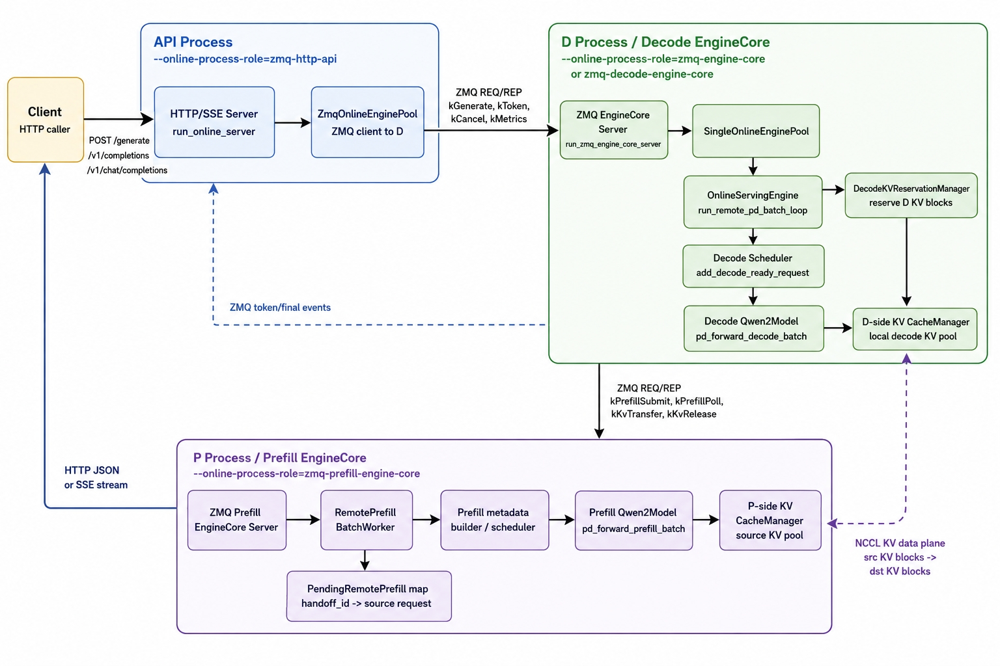

# PagedBatchEngine

PagedBatchEngine 是一个面向大模型推理服务的 C++/CUDA 推理框架。项目以 Qwen2/Qwen2.5 serving 路径为主线，实现了 paged KV cache、continuous batching、chunked prefill、prefix cache、FP8 KV Cache、在线 HTTP 服务、P/D 分离等特性。

## 功能概览

- **模型支持**：Qwen2/Qwen2.5
- **执行后端**：CPU 基础算子与 CUDA 高性能路径；paged KV serving 主要面向 CUDA。
- **核心算子**：Embedding、Matmul、RMSNorm、RoPE、SwiGLU、MHA、PagedAttention、MoE、Sampler。
- **Paged KV cache**：按 block 管理 KV 池，支持 page table、引用计数、请求级释放和容量统计。
- **Prefix cache**：压缩 radix tree 复用块对齐 prompt 前缀，提供命中、发布、淘汰等统计。
- **Continuous batching**：按 token budget 调度 prefill/decode，支持 FCFS/priority、chunked prefill、KV preemption。
- **采样**：支持 greedy、temperature、top-k、top-p；repetition penalty 或较大 top-k 会走 CPU fallback。
- **在线服务**：提供 `/generate`、`/v1/completions`、`/v1/chat/completions`、`/health`、`/metrics`。
- **P/D 分离**：支持双 GPU P2P、NCCL、layer-wise NCCL，以及 ZMQ 远程进程拆分。

## 整体架构

下图展示了项目从入口层、serving runtime、Qwen2 模型执行、KV cache 管理到可选 P/D 分离的主流程。


## 实验结果

### 256 多请求并发效果

该实验用于验证在线 serving 在高并发请求下的吞吐能力和生成稳定性。

| Concurrency | Generated tokens | Wall time (s) | Throughput (tok/s) |
| ---: | ---: | ---: | ---: |
| 256 | 71,972 | 151.156 | 476.15 |

示例输出片段：

```text
pd256_user_255.json
Metrics like the "total_tokens" and "total_sentences" can help show whether generated tokens are continuously increasing...

pd256_user_256.json
The tradeoffs of serving many small models versus one large model in the context of AI and machine learning involve several key considerations...
```

### vLLM 对比效果

Prompt tokens are shown as `p50/p95/max`. Throughput is output tokens per second.

| Engine | Workload | Requests | Prompt tokens p50/p95/max | Max new tokens | Output tok/s | TTFT p95 ms | ITL p95 ms | E2E p99 ms | Success |
| --- | --- | ---: | ---: | ---: | ---: | ---: | ---: | ---: | ---: |
| PagedBatchEngine | decode_only_focus | 6 | 31/32/32 | 256 | 98.21 | 124.80 | 18.27 | 1884.11 | 100.0% |
| vLLM | decode_only_focus | 6 | 31/32/32 | 256 | 102.03 | 36.62 | 15.88 | 2361.96 | 100.0% |

PagedBatchEngine internal profiling:

| Workload | Schedule ms | Metadata ms | Forward ms | Sample ms | Process ms | Decode-only ratio | Avg waiting | Max waiting | Avg running | Max running | KV preemptions | Decode tokens |
| --- | ---: | ---: | ---: | ---: | ---: | ---: | ---: | ---: | ---: | ---: | ---: | ---: |
| decode_only_focus | 0.015 | 0.046 | 3.172 | 13.944 | 0.009 | 0.938 | 0.09 | 4 | 1.78 | 6 | 0 | 191 |

单请求对比：

| Engine | Prompt tokens | Output tokens | Output tok/s | TTFT ms | ITL ms | E2E latency ms |
| --- | ---: | ---: | ---: | ---: | ---: | ---: |
| PagedBatchEngine | 39 | 256 | 57.51 | 18.51 | 17.38 | 4450.81 |
| vLLM | 39 | 256 | 63.33 | 19.58 | 15.78 | 4042.28 |

对比 prompt：

```text
Explain why KV cache improves transformer decoding performance.
```

同 prompt 推理输出片段对照：

**PagedBatchEngine output**

```text
Transformer models, which are a type of deep learning model used for natural
language processing tasks, rely heavily on the self-attention mechanism to
process input sequences. This mechanism allows the model to weigh the importance
of different words in the input sequence when generating the output sequence.
However, this process can be computationally expensive, especially for long
sequences, as it requires calculating attention scores between every pair of
words in the sequence.

Key-Value (KV) cache is a technique that can significantly improve the
performance of transformer decoding by reducing the computational cost of the
self-attention mechanism. Here's how it works:

1. **Memory Efficiency**: KV cache stores the key-value pairs from the previous
decoding step. This means that instead of recalculating the attention scores for
every word in the sequence, the model can reuse the stored key-value pairs from
the previous step.

2. **Reduced Computation**: By reusing the key-value pairs, the model avoids the
need to compute attention scores for the entire sequence at each step.
```

**vLLM output**

```text
Transformer models, which are a type of deep learning model used for natural
language processing tasks, rely heavily on the self-attention mechanism to
process input sequences. This mechanism allows the model to weigh the importance
of different words in the input sequence when generating the output sequence.
However, this process can be computationally expensive, especially for long
sequences, as it requires calculating attention scores between every pair of
words in the sequence.

Key-Value (KV) cache is a technique that can significantly improve the
performance of transformer decoding by reducing the computational cost of the
self-attention mechanism. Here's how it works:

1. **Memory Efficiency**: KV cache stores the key-value pairs from the previous
decoding step. This means that instead of recalculating the attention scores for
every word in the sequence, the model can reuse the stored key-value pairs from
the previous step.

2. **Reduced Computation**: By reusing the key-value pairs, the model avoids the
need to compute attention scores for the entire sequence at each step.
```

可以看到，两者在同一 prompt 下都围绕 self-attention 的重复计算、KV cache 复用历史 key/value、降低逐 token decode 计算量这几个核心点展开，推理输出内容和结构基本一致。


## 项目结构

```text
.
├── infMain/include        # 公开头文件：base、tensor、op、model、serving
├── infMain/source         # C++/CUDA 实现
│   ├── base               # allocator、KV cache、runtime、radix cache
│   ├── model              # Llama/Qwen 模型与 paged KV runtime
│   ├── op                 # 算子封装与 CPU/CUDA kernel
│   ├── sampler            # sampler 抽象与 argmax sampler
│   └── serving            # scheduler、HTTP/ZMQ、P/D handoff、benchmark app
├── demo                   # 离线推理与 serving demo
├── test                   # GTest 单测和算子/serving 测试
├── tools                  # 模型导出与 benchmark 工具
├── docs/benchmarks        # benchmark JSON/Markdown 报告
└── hf_infer               # HuggingFace 对照推理脚本
```

## 依赖环境

推荐环境：

- Ubuntu 22.04
- CMake 3.16+
- C++17 编译器
- CUDA Toolkit，项目默认使用 `/usr/local/cuda/bin/nvcc`
- NVIDIA GPU，Qwen2 serving/paged KV 路径需要 CUDA
- NCCL，P/D 分离和多 GPU KV 传输需要
- glog、GTest、Armadillo、SentencePiece
- abseil、re2、nlohmann_json，启用 Llama3/Qwen2/Qwen3/Qwen-MoE 时需要
- libzmq，可选；启用远程 ZMQ 进程拆分时需要

依赖可以使用系统包，也可以通过 `-DUSE_CPM=ON` 让 CMake 自动拉取部分依赖。无网络或依赖已安装的环境建议关闭 `USE_CPM`。

## 编译

以 Qwen2/Qwen2.5 serving 路径为例：

```bash
cmake -S . -B build -DQWEN2_SUPPORT=ON -DUSE_CPM=ON
cmake --build build -j
```

如果依赖已在系统或 Conda 环境中安装：

```bash
cmake -S . -B build -DQWEN2_SUPPORT=ON -DUSE_CPM=OFF
cmake --build build -j
```

主要产物：

- `build/libllama.so`：核心共享库
- `build/demo/serving_qwen`：Qwen2 continuous batching/online serving demo
- `build/demo/qwen_infer`、`qwen_instruct_infer`、`qwen_instruct_chat`：Qwen2 单请求 demo
- `build/test/test_llm`：单元测试集合

## 模型导出

推理程序读取项目自定义 `.bin` 权重格式。以下示例以 `Qwen2-7B-Instruct` 为主；如果需要更轻量的验证模型，可以把路径中的 `Qwen2-7B-Instruct` 替换为 `Qwen2-0.5B-Instruct`。

```bash
# 下载 HuggingFace 模型后，将其导出为 fp32 bin
python3 tools/export_qwen2.py Qwen2-7B-Instruct.bin --hf=Qwen/Qwen2-7B-Instruct

# 导出 bf16 bin；dtype=bf16 时脚本会使用 legacy bf16 格式
python3 tools/export_qwen2.py Qwen2-7B-Instruct.bf16.bin \
  --hf=Qwen/Qwen2-7B-Instruct \
  --dtype=bf16

# 导出 int8 量化格式
python3 tools/export_qwen2.py Qwen2-7B-Instruct.int8.bin \
  --hf=Qwen/Qwen2-7B-Instruct \
  --version=3
```

## 离线推理与 Serving

### 单请求/聊天 demo

```bash
./build/demo/qwen_infer Qwen2-7B-Instruct.bin Qwen/Qwen2-7B-Instruct/tokenizer.json
./build/demo/qwen_instruct_infer Qwen2-7B-Instruct.bin Qwen/Qwen2-7B-Instruct/tokenizer.json
./build/demo/qwen_instruct_chat Qwen2-7B-Instruct.bin Qwen/Qwen2-7B-Instruct/tokenizer.json
```

### Continuous batching 离线 benchmark

```bash
./build/demo/serving_qwen \
  Qwen2-7B-Instruct.bf16.bin \
  Qwen/Qwen2-7B-Instruct/tokenizer.json \
  "What is AI?" \
  "Write a haiku about coding." \
  --max-new-tokens=128 \
  --max-batched-tokens=auto \
  --prefill-chunk-cap=auto \
  --warmup-rounds=1 \
  --step-profile=1 \
  --final-summary=1
```

`serving_qwen` 会输出：

- `CONFIG_SUMMARY`：模型容量、KV/workspace 预算、调度参数
- `STEP_PROFILE`：schedule、metadata、forward、sample、process 耗时
- `REQUEST_METRIC`：单请求 TTFT、ITL、E2E latency
- `FINAL_SUMMARY`：吞吐、延迟分位数、prefix cache 和 scheduler 统计

### 在线 HTTP 服务

```bash
./build/demo/serving_qwen \
  Qwen2-7B-Instruct.bf16.bin \
  Qwen/Qwen2-7B-Instruct/tokenizer.json \
  --online-server=1 \
  --listen-host=127.0.0.1 \
  --listen-port=8080 \
  --max-new-tokens=128 \
  --max-queue-size=128 \
  --request-timeout-ms=300000
```

健康检查：

```bash
curl -sS http://127.0.0.1:8080/health
curl -sS http://127.0.0.1:8080/metrics
```

普通生成：

```bash
curl -sS http://127.0.0.1:8080/generate \
  -H 'Content-Type: application/json' \
  -d '{
    "prompt": "Explain paged KV cache briefly.",
    "max_new_tokens": 64,
    "temperature": 0.0,
    "stream": false
  }'
```

OpenAI 兼容 chat completion：

```bash
curl -sS http://127.0.0.1:8080/v1/chat/completions \
  -H 'Content-Type: application/json' \
  -d '{
    "messages": [{"role": "user", "content": "What is continuous batching?"}],
    "max_tokens": 64,
    "temperature": 0.0,
    "stream": true
  }'
```

## P/D 分离模式

`serving_qwen` 支持以下 `--pd-mode`：

- `off`：默认模式，prefill/decode 在同一个模型实例上执行
- `dual-gpu-p2p`：双 GPU，本进程内通过 CUDA P2P 拷贝 KV
- `dual-gpu-nccl`：双 GPU，本进程内通过 NCCL 拷贝 KV
- `remote-zmq-cpu`：ZMQ 远程 prefill，KV 通过 CPU payload 返回
- `remote-zmq-nccl`：ZMQ 协调，KV 通过 NCCL 传输

远程 ZMQ 模式需要分别启动 API Process、P Process 和 D Process。`remote-zmq-nccl` 模式下，ZMQ 负责控制面和请求/事件转发，KV cache 数据面通过 NCCL 从 P 侧传到 D 侧。



下面示例使用三进程部署：

- API Process：暴露 HTTP/SSE 接口，作为 ZMQ client 连接 D Process。
- P Process：执行 prefill，维护 P-side KV cache，并响应 D Process 的 prefill/KV transfer 请求。
- D Process：执行 decode，维护 D-side KV cache，协调远程 prefill 和 NCCL KV 接收。

启动顺序建议为：先 P Process，再 D Process，最后 API Process。

### P Process: Prefill EngineCore

```bash
./build/demo/serving_qwen \
  Qwen2-7B-Instruct.bf16.bin \
  Qwen/Qwen2-7B-Instruct/tokenizer.json \
  --online-server=1 \
  --online-process-role=zmq-prefill-engine-core \
  --pd-mode=remote-zmq-nccl \
  --prefill-device-id=0 \
  --decode-device-id=1 \
  --prefill-zmq-endpoint=tcp://127.0.0.1:19091 \
  --engine-zmq-timeout-ms=30000 \
  --max-batched-tokens=auto \
  --prefill-chunk-cap=auto \
  --max-new-tokens=128
```

### D Process: Decode EngineCore

```bash
./build/demo/serving_qwen \
  Qwen2-7B-Instruct.bf16.bin \
  Qwen/Qwen2-7B-Instruct/tokenizer.json \
  --online-server=1 \
  --online-process-role=zmq-decode-engine-core \
  --pd-mode=remote-zmq-nccl \
  --prefill-device-id=0 \
  --decode-device-id=1 \
  --engine-zmq-endpoint=tcp://127.0.0.1:19090 \
  --prefill-zmq-endpoint=tcp://127.0.0.1:19091 \
  --engine-zmq-timeout-ms=30000 \
  --max-batched-tokens=auto \
  --prefill-chunk-cap=auto \
  --max-new-tokens=128
```

### API Process: HTTP API

```bash
./build/demo/serving_qwen \
  --online-server=1 \
  --online-process-role=zmq-http-api \
  --listen-host=127.0.0.1 \
  --listen-port=8080 \
  --engine-zmq-endpoint=tcp://127.0.0.1:19090 \
  --engine-zmq-timeout-ms=30000 \
  --request-timeout-ms=300000 \
  --max-queue-size=128
```

三进程都启动后，可以通过 API Process 访问：

```bash
curl -sS http://127.0.0.1:8080/health

curl -sS http://127.0.0.1:8080/generate \
  -H 'Content-Type: application/json' \
  -d '{
    "prompt": "Explain why long-context requests increase KV cache usage.",
    "max_new_tokens": 64,
    "temperature": 0.0,
    "stream": false
  }'
```

## Benchmark

内置 workload 配置在 `tools/bench/workloads.json`。运行 PagedBatchEngine benchmark：

```bash
python3 tools/bench/run_pagedbench.py \
  --binary ./build/demo/serving_qwen \
  --model Qwen2-7B-Instruct.bf16.bin \
  --tokenizer Qwen/Qwen2-7B-Instruct/tokenizer.json \
  --workloads decode_only_focus \
  --runs 5 \
  --max-new-tokens 256 \
  --max-batched-tokens 16 \
  --prefill-chunk-cap 8 \
  --warmup-rounds 1
```

运行 PagedBatchEngine 与 vLLM 对比：

```bash
python3 tools/bench/run_baselines.py \
  --binary ./build/demo/serving_qwen \
  --model-bin Qwen2-7B-Instruct.bf16.bin \
  --tokenizer Qwen/Qwen2-7B-Instruct/tokenizer.json \
  --vllm-model Qwen/Qwen2-7B-Instruct \
  --workloads decode_only_focus \
  --runs 5 \
  --max-new-tokens 256 \
  --max-batched-tokens 16 \
  --prefill-chunk-cap 8
```

生成 README 表格：

```bash
python3 tools/bench/render_readme_tables.py \
  --paged-json docs/benchmarks/pagedbench-baseline.json \
  --vllm-json docs/benchmarks/vllm-baseline.json \
  --output docs/benchmarks/readme-tables.md
```

## 测试

```bash
./build/test/test_llm
```

也可以按 GTest filter 只跑部分模块：

```bash
./build/test/test_llm --gtest_filter='PDHandoffTest.*:PDEngineTest.*:PDWorkerTest.*'
./build/test/test_llm --gtest_filter='Qwen2DeviceInitTest.*'
```

Paged attention benchmark：

```bash
./build/test/paged_attention_fast_bench
./build/test/paged_attention_fp8_bench
```

## 常用参数

`serving_qwen` 常用参数：

- `--max-new-tokens=N`：每个请求最大生成 token 数
- `--max-batched-tokens=N|auto`：每步调度 token budget
- `--prefill-chunk-cap=N|auto`：每个 prefill 请求单步最大 chunk
- `--scheduling-policy=fcfs|priority`：调度策略
- `--long-prefill-token-threshold=N`：长 prefill 判定阈值
- `--max-partial-prefills=N`：并发 partial prefill 限制
- `--max-long-partial-prefills=N`：长 partial prefill 并发限制
- `--kv-cache-memory-utilization=0.8`：KV cache 使用可用显存比例
- `--radix-cache=on|off`：开启或关闭 prefix cache
- `--device-id=N`：单 GPU 设备
- `--prefill-device-id=N`、`--decode-device-id=N`：P/D 模式设备
- `--online-server=0|1`：是否启动 HTTP 服务
- `--listen-host=HOST`、`--listen-port=PORT`：HTTP 地址
- `--max-queue-size=N`：在线请求队列上限
- `--request-timeout-ms=N`：在线请求超时
- `--step-profile=0|1`、`--step-trace=0|1`、`--final-summary=0|1`：profiling 输出

环境变量：

- `KUIPER_USE_FP8_KV_CACHE=1`：启用 FP8 KV cache，当前要求 BF16 runtime 和 CUDA
- `KUIPER_BATCH_SAMPLE_CPU_FALLBACK=1`：强制批采样走 CPU fallback

## 当前限制

- Qwen2/Qwen2.5 是 serving 路径最完整的模型；其他模型主要用于基础推理和导出实验。
- Paged KV runtime 的 CPU 分支当前是 stub，paged attention serving 依赖 CUDA。
- 采样配置已支持常见参数；部分组合会回退到 CPU，吞吐会受影响。
- 远程 ZMQ/NCCL P/D 模式对网络、NCCL、GPU peer access 和进程启动顺序有额外要求。

## 代码阅读入口

- 模型抽象：`infMain/include/model/model.h`
- Qwen2 serving：`infMain/include/model/qwen2.h`、`infMain/source/model/qwen2.cpp`
- Paged KV runtime：`infMain/include/model/paged_kv_runtime.h`
- KV cache：`infMain/include/base/kv_cache_manager.h`
- Prefix cache：`infMain/include/base/compressed_radix_cache_tree.h`
- 调度器：`infMain/include/serving/scheduler.h`
- 在线服务：`infMain/source/serving/serving_online_server.cpp`
- P/D handoff：`infMain/include/serving/pd_handoff.h`
- Benchmark app：`infMain/source/serving/serving_benchmark_app.cpp`
